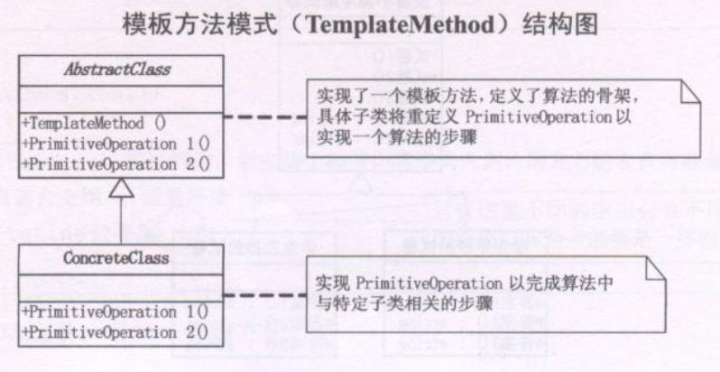

在现代考试中，是以这样一种方式进行的，试卷被打印多份，然后考生进行作答。假如老师要改题目那么只需要更改源文件上的题目重新打印即可，即考生是不需要去抄试卷再作答的。
```typescript
class TestPaper {
  public Q1() {
    console.log('你喜欢的运动？A、篮球 B、足球 C、羽毛球')
    console.log(`答案：${this.Answer1()}`)
  }
  protected Answer1() { /*模板方法*/
    return ''
  }
  public Q2() {
    console.log('你喜欢喝咖啡吗？A、喜欢 B、一般般 C、不喜欢')
    console.log(`答案：${this.Answer2()}`)
  }
  protected Answer2() { /*模板方法*/
    return ''
  }
  public Q3() {
    console.log('你擅长的外语？A、英语 B、日语 C、韩语')
    console.log(`答案: ${this.Answer3()}`)
  }
  protected Answer3() { /*模板方法*/
    return ''
  }
}

/**学生A作答的试卷 */
class TestPaperA extends TestPaper {
  protected Answer1() {
    return 'A'
  }
  protected Answer2() {
    return 'B'
  }
  protected Answer3() {
    return 'C'
  }
}

/**学生B作答的试卷 */
class TestPaperB extends TestPaper {
  protected Answer1() {
    return 'A'
  }
  protected Answer2() {
    return 'A'
  }
  protected Answer3() {
    return 'A'
  }
}
```

在以上的例子中，我们**既然用了继承，并且肯定这个继承有意义，就应该要成为子类的模板，所有重复的代码都应该要上升到父类去，而不是让每个子类都去重复**。

**当我们要完成在某一细节层次一致的一个过程或一系列步骤，但其个别步骤在更详细的层次上的实现可能不同时，我们通常考虑用模板方法模式来处理**。


### 定义
模板方法模式，**定义一个操作中的算法的骨架，而将一些步骤延迟到子类中。模板方法使得子类可以不改变一个算法的结构即可重定义改算法的某些特定步骤**



在这里骨架即 父类TestPaper中的各类question，将answer的实现延迟到子类中。通过answer的延迟，然后再question类中调用，实现了question的统一，但answer的个性化。