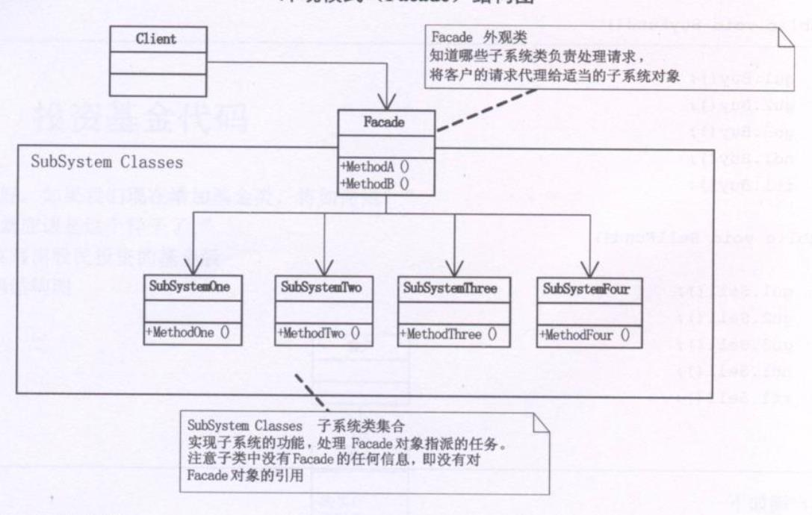
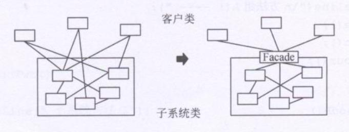

**外观模式(Facade)**，为子系统中的一组接口提供一个一致的界面，此模式定义了一个高层接口，这个接口使得这一子系统更加容易使用。



例子：炒股票有多种形式，一种是股民直接买入，直接卖出；一种是购买基金的形式，套用到设计模式中，购买基金类似于外观模式，股民把这些用于炒股的资金，交由一个专业的基金经理人，让他进行买入与卖出操作，股民只需与基金经理人打叫道即可。而假如股民直接进行股票的买入卖出操作，他需要管理并关注多只股票，在编程中即**股民与股票的耦合性过高**。
```typescript
 class Stock {
  name:string
  public sell() {
    console.log(`${this.name} 卖出`)
  }
  public buy() {
    console.log(`${this.name} 买入`)
  }
}
class Stock1 extends Stock {
  name:string = '股票1'
}
class Stock2 extends Stock {
  name:string = '股票2'
}
class Stock3 extends Stock {
  name:string = '股票3'
}

/**基金类 */
class Fund {
  private gu1 = new Stock1()
  private gu2 = new Stock2()
  private gu3 = new Stock3()

  public buyFund() {
    this.gu1.buy()
    this.gu2.buy()
    this.gu3.buy()
  }

  public sellFund() {
    this.gu1.sell()
    this.gu2.sell()
    this.gu3.sell()
  }
}

const jijin = new Fund()
jijin.buyFund()
jijin.sellFund()
```

### 何时使用外观模式
首先，**在设计初期阶段，应该要有意识的将不同的两个层分离**，比如经典的三层架构，就需要考虑在数据访问层和业务逻辑层、业务逻辑层和表示层的**层与层之间建立外观**。

其次，**在开发阶段，子系统往往因为不断的重构演化而变得越来越复杂**。大多数的模式使用时也都会产生很多很小的类，这本是好事，但也给外部调用它们的用户程序带来了使用上的麻烦，**增加外观可以提供一个简单的接口，减少它们之间的依赖。**

第三，**在维护一个遗留的大型系统时，可能这个系统已经非常难以维护和拓展了**，但因为它包含非常重要的功能，新的需求开发必须要依赖它，此时用外观模式也是非常合适的。**为新系统开发一个外观类，来提供设计粗糙或高度复杂的遗留代码的比较清晰简单的接口，让新系统与外观交互，外观与遗留代码交互所有复杂的工作**。

