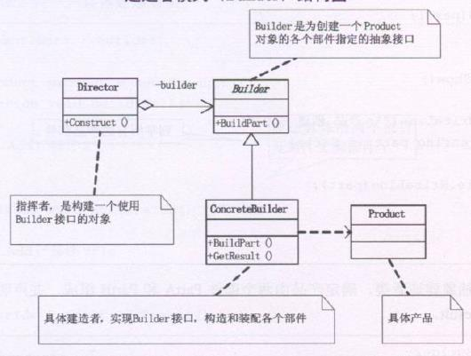

**建造者模式(builder)**，将一个复杂对象的构建与它的表示分离，使得同样的构建过程可以创建不同的表示。

例，我们有一个建造小人的需求，这个建造的‘过程’是稳定的，都需要头身手脚，而具体建造的‘细节’是不同的，有胖有瘦有高有矮。但对于用户来讲，才不管这些，我只想告诉你，我需要一个胖小人来游戏，于是你就建造一个给我就行了。此时就需要应用到‘建造者模式’，**又叫生成器模式**

建造者模式**可以将一个产品的内部表象与产品的生成过程分割开来**，从而使一个建造过程生成具有不同的内部表象的产品对象。**如果我们用了建造者模式，那么用户就只需指定需要建造的类型就可以得到它们，而具体建造的过程和细节就不需知道了**。




```typescript
abstract class PersonBuilder {
  public buildHead() {}
  public buildBody() {}
  public buildArmLeft() {}
  public buildArmRight() {}
  public buildLegLeft() {}
  public buildLegRight() {}
}

class PersonThinBuilder extends PersonBuilder {
  public buildHead() {
    console.log('瘦人的头')
  }
  public buildBody() {
    console.log('瘦人的身体')
  }
  public buildArmLeft() {
    console.log('瘦人的左手')
  }
  public buildArmRight() {
    console.log('瘦人的右手')
  }
  public buildLegLeft() {
    console.log('瘦人的左脚')
  }
  public buildLegRight() {
    console.log('瘦人的右脚')
  }
}

class PersonFatBuilder extends PersonBuilder {
  /**方法重写 省略 */
}

/**指挥者 */
class PersonDirector {
  private pb:PersonBuilder
  constructor (pb) {
    this.pb = pb
  }
  public createPerson() {
    this.pb.buildHead()
    this.pb.buildBody()
    this.pb.buildArmLeft()
    this.pb.buildArmRight()
    this.pb.buildLegLeft()
    this.pb.buildLegRight()
  }
}

const ptb = new PersonThinBuilder()
const pdThin = new PersonDirector(ptb)
pdThin.createPerson()

```


建造者模式主要是用于创建一些复杂的对象，这些对象内部构建间的建造顺序通常是稳定的，但对象内部的构建通常面着复杂的变化

建造者模式的**好处是使得建造代码与表示代码分离**，由于建造者隐藏了该产品是如何组装的，所以弱需要改变一个产品的内部表示，只需要再定义一个具体的建造者就可以了

**建造者模式是在当创建的复杂对象的算法应该独立于该对象的组成部分以及它们的装配方式时适用**。