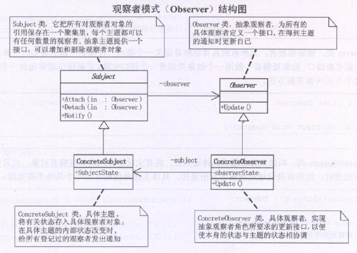

观察者模式又叫做**发布-订阅**(Publish/Subscribe)模式

观察者模式定义了一种一对多的依赖关系，让多个观察者对象同时监听某一个主题对象。这个主题对象在状态发生变化时，会通知所有观察者对象，试它们能够自动更新自己。



```typescript
/**抽象观察者 */
class Observer {
  public Update() {}
}

/**抽象主题 */
class Subject {
  private observers:Observer[] = new Array()

  /**增加观察者 */
  public Attach(observer:Observer) {
    this.observers.push(observer)
  }

  /**移除观察者 */
  public Detach(observer:Observer) {
    this.observers.find((item,index) => {
      if(item === observer) {
        this.observers.splice(index,1)
        return true
      }
    })
  }

  /**通知 */
  public Notify() {
    this.observers.forEach(item => item.Update())
  }
}

/**具体主题 */
class ConcreteSubject extends Subject {
  private _state:string = ''
  set state(value) {
    this._state = value
    this.Notify() /**当状态发生变化时，通知已记录的观察者 */
  }
  get state() {
    return this._state
  }
}

/**具体观察者 */
class ConcreteObserver extends Observer {
  constructor(private name:string) {
    super()
  }
  public Update() {
    console.log(`${this.name}收到通知，进行具体操作`)
  }
}

const observer1 = new ConcreteObserver('观察者1')
const observer2 = new ConcreteObserver('观察者2')
const s = new ConcreteSubject()
s.Attach(observer1)
s.Attach(observer2)
s.state = '我回来了'
```

### 观察者模式特点
将一个系统分割成一系列相互写作的类有一个很不好的副作用，那就是需要维护相关对象间的一致性，我们不希望为了维持一致性而使各类紧密耦合，这样会给维护、拓展和重用带来不便。

观察者模式所做的工作其实就是在解除耦合。让耦合的双方都依赖于抽象，而不是依赖于具体。从而使得各自的变化都不会影响另一边的变化。

### 何时使用
当一个对象的改变需要同时改变其他对象的时候，而且它不知道具体有多少对象有待变化时，应该考虑使用观察者模式

当一个抽象模型有两个方面，其中一方面依赖于另一方面，这时用观察者模式可以将这两者封装在独立的对象中使它们各自独立地改变和复用。

### 观察者模式的不足
尽管已经用来依赖倒转原则，但事实‘抽象通知者’还是依赖于‘抽象观察者’，也就是说，万一没有了抽象观察者的接口，通知的功能就无法完成了，其次每一个观察者，它不一定是‘更新’方法要调用，也可能是‘隐藏’方法要调用，即方法名不同，这应该就是不足的地方。

如果**通知者和观察者之间根本就互相不知道，由客户端来决定通知谁，那就好了**，具体的方法实现会在下一章[事件委托](./../15.事件委托实现/index.md)中进行讲解
