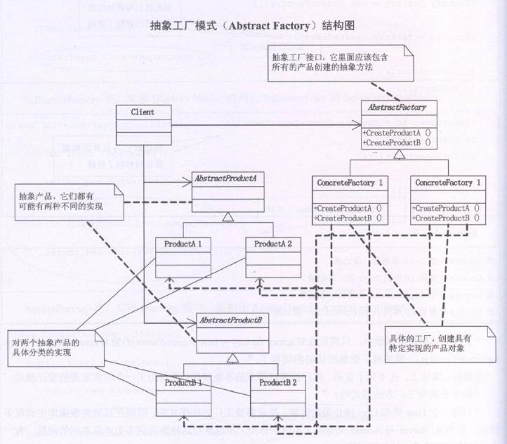

**抽象工厂模式(Abstract Factory)**，提供一个创建一系列相关或相互依赖对象的接口，而无需指定它们具体的类



AbstractProductA和AbstractProductB是两个抽象产品，而ProductA1、ProductA2和ProductB1、ProductB2就是对两个抽象产品的具体分类的实现。

**IFactory是一个抽象工厂接口，它里面应该包含所有的产品创建的抽象方法。而ConcreteFactory1和ConcreteFactory2就是具体的工厂**。

**通常是在运行时再创建一个ConcreteFactory类的实例，这个具体的工厂再创建具有特定实现的产品对象，也就是说，为创建不同的产品对象，客户端应使用不同的工厂**。

```typescript
interface IDepartment {
  Insert(department:any):any
  GetDepartment(id: any):any
}

class SqlserverDepartment implements IDepartment {
  Insert(department:any) {
    console.log('在 SQL Server中给Department表添加一条记录')
  }
  GetDepartment(id:any) {
    console.log('在SQL Server中根据ID得到Department表一条记录')
  }
}

class AccessDepartment implements IDepartment {
  Insert(department:any) {
    console.log('在Access中给Department表添加一条记录')
  }
  GetDepartment(id:any) {
    console.log('在Access中根据ID得到Department表一条记录')
  }
}
interface IFactory { /*抽象工厂接口，核心作用是要求不同的工厂实现相同的接口*/
  CreateDepartment():any
}

class SqlServerFactory implements IFactory {
  CreateDepartment() {
    return new SqlserverDepartment()
  }
}

class AccessFactory implements IFactory {
  CreateDepartment() {
    return new AccessDepartment()
  }
}
const dept = new Department()
// const factory = new SqlServerFactory()
const factory = new AccessFactory()
const id = factory.CreateDepartment() /*由于抽象工厂接口的存在，具体的类实例化与客户端分离，而包裹在CreateDepartment内部*/
id.Insert(dept)
id.GetDepartment(1)
```


### 抽象工厂模式的优点

抽象工厂模式最大的好处便是交换产品系列，由于具体工厂类，例如 Factory = new AccessFactory() 在一个应用中只需要初始化的时候出现一次，这就使得改变一个应用的具体工厂变得非常容易，它只需要改变具体工厂即可使用不同的产品配置。

它让具体的创建实例过程与客户端分离，客户端是通过它们的抽象接口操纵实例，产品的具体类名也被具体工厂的实现分离，不会出现在客户代码中

### 抽象工厂模式的缺点
假如此时要增加项目表Project，则至少需要增加三个类，IProject,SqlserverProject,AccessProject，还需要更改 IFactory, SqlServerFactory, AccessFactory 才可以完全实现。

其次 假如有100个客户  需要从 new AccessFactory() 更改为 new SqlServerFactory() 那么我们需要改100次。

显然这都是非常糟糕的一件事。

### 用简单工厂来改进抽象工厂
去除 IFactory、SqlserverFactory和AccessFactory 三个工厂类，取而代之的是DataAccess类，用一个简单工厂模式来实现

```typescript
class DataAccess {
  static db:string = 'Sqlserver'
  // private db:string = 'Access'
  public static createDepartment() { 
    switch(this.db) {
      case 'Sqlserver':
        return new SqlServerDepartment()
      case 'Access':
        return new AccessDepartment()
    }
  }
}

const dept = new Department()
const id = DataAccess.createDepartment()
id.Insert(dept)
id.GetDepartment(1)
```
**所有在用简单工厂的地方，都可以考虑用反射技术来去除switch或if,解除分支判断带来的耦合**。即本例中的 switch 分支判断的问题同样可以用反射解决，这里省略