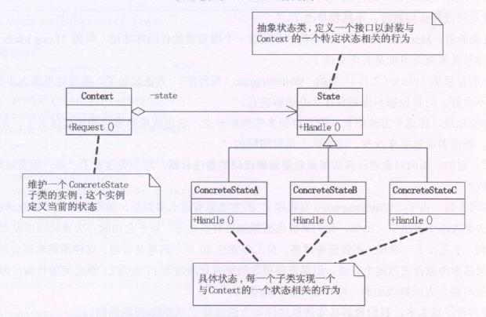

**状态模式(state)**，当一个对象的内在状态改变时允许改变其行为，这个对象看起来像是改变了其类

状态模式主要解决的是当控制一个对象状态转换的条件表达式过于复杂时的情况。把状态的判断逻辑转移到表示不同状态的一系列类当中，可以把复杂的状态判断逻辑简化。


```typescript
abstract class State {
  public abstract Handle(context:Context):void
}
class ConcreteStateA extends State {
  public Handle(context:Context) {
    context.state = new ConcreteStateB()  
    /*进行该状态下的具体行为*/
    /**将Context的实例状态改变为 ConcreteStateB 的实例，
     * 下次Context的实例再次Request时 则触发的是 ConcreteStateB的Handle方法
    */
  }
}
class ConcreteStateB extends State {
  public Handle(context:Context) {
    context.state = new ConcreteStateA()
    /*进行该状态下的具体行为*/
  }
}
class Context {
  constructor(private _state:State) {}
  get state() {
    return this._state
  }
  set state(value) {
    this._state = value
    console.log('当前状态' + this._state)
  }
  public Request():void {
    this.state.Handle(this) /**传入this */
  }
}
const c = new Context(new ConcreteStateA())
c.Request()
c.Request()
c.Request()
c.Request()
c.Request()
```
### 状态模式的好处与用处
将与特定状态相关的行为局部化，并且将不同状态的行为分割开来。即将特定的状态相关的行为都放入一个对象中，由于所有与状态相关的代码都存在于某个ConcreteState中，所以通过定义新的子类可以很容易地增加新的状态和转换。

消除庞大的状态条件分支语句，状态模式通过把各种状态转移逻辑分布到State的子类之间，来减少相互间的依赖。

**当一个对象的行为取决于它的状态，并且它必须在运行时刻根据状态改变它的行为时，就可以考虑使用状态模式了**。