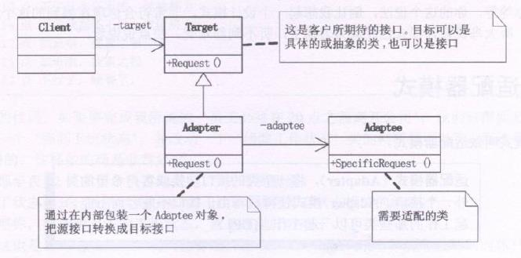

**适配器模式(Adapter)**，将一个类的接口转换成客户希望的另外一个接口。Adapter 模式使得原本由于接口不兼容而不能一起工作的那些类可以一起工作。

简单地说，**就是需要的东西就在面前，但却不能使用，而短时间又无法改造它，于是我们就想办法适配它**。例如有些国家用110V电压，而我们国家用的是220V，此时就需要一个能把电源变成需要的电压的电源适配器了。

也就是 **系统的数据和行为都正确，但接口不符时，我们应该考虑用适配器，目的是使控制范围之外的一个原有对象与某个接口匹配。适配器模式主要应用于希望复用一些现存的类，但是接口又与复用环境要求不一致的情况**。

适配器模式有两种类类型，**类适配器模式和对象适配器模式**，由于类适配器模式通过多重继承对一个接口与另一个接口进行匹配，而 C#、JAVA、Javascript等语言都不支持多重继承(C++支持)，也就是一个类只有一个父类，所以我们这里主要讲的是对象适配器。


```typescript
/**适配器抽象类 */
class Target {
  public Request() {
    console.log('普通请求')
  }
}
/**需要被适配的类 */
class Adaptee {
  public SpecificRequest() {
    console.log('特殊请求')
  }
}
/**具体的适配器 */
class Adapter extends Target {
  private adaptee = new Adaptee() 
  public Request() {
    this.adaptee.SpecificRequest()
    /**这样就可以把表面上调用Request()方法变成实际调用 SpecificRequest */
  }
}

const target = new Adapter()
target.Request()

```

### 何时使用适配器模式
使用一个已经存在的类，但如果它的接口，也就是它的方法和你的要求不相同时。就应该考虑用适配器模式

两个类所作的事情相同或相似，但是具有不同的接口时要使用适配器模式

客户代码可以统一调用同一接口，但类和方法的命名应该在一考试时要规范好，在栓发都不太容易修改的时候再使用适配器模式适配