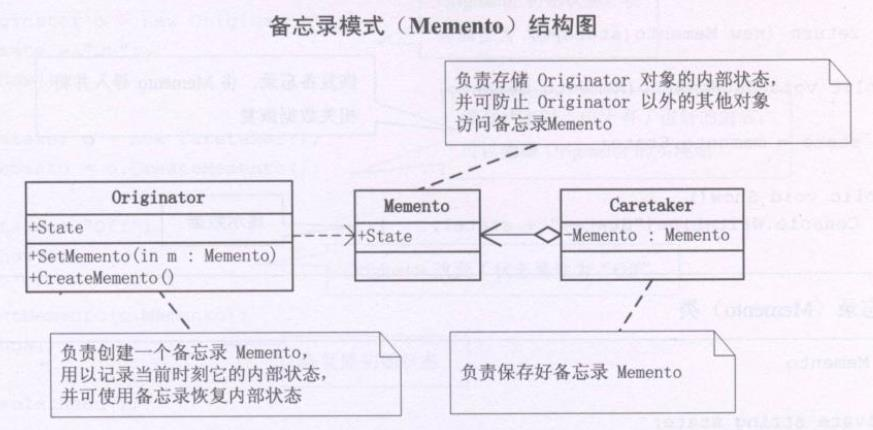

**备忘录(Memento)**，在不破坏封装性的前提下，捕获一个对象的内部状态，并在该对象之外保存这个状态。这样以后就可将该对象恢复到原先保存的状态。


```typescript
/**发起人（可以简单地理解为游戏） */
class Originator {
  private _state:string = ''
  get state () {
    return this._state
  }
  set state(value) {
    this._state = value
  }

  /**创建一个备忘录，将当前需要保存的信息导入并实例化出一个Memento对象 */
  public CreateMemento() { /**保存 */
    return new Memento(this.state)
  }

  /**恢复备忘录，将Memento 导入并将相关数据恢复 */
  public SetMemento(memento) { /**读取 */
    this.state = memento.state
  }

  public Show() {
    console.log(this.state)
  }
}

/**备忘录类（备份） */
class Memento {
  constructor(private _state:string) {}

  get state () {
    return this._state
  }
}

/**管理者 管理备忘录 */
class Caretaker {
  private _memento:Memento
  get memento() {
    return this._memento
  }
  set memento(memento:Memento) {
    this._memento = memento
  }
}

const o = new Originator()
o.state = 'on' /**开始游戏 */
o.Show()

const c = new Caretaker()
c.memento = o.CreateMemento() /**保存游戏 */

o.state = 'off' /**关闭游戏 */
o.Show()

o.SetMemento(c.memento) /**读取进度 */
o.Show()
```

### 何时使用备忘录模式
Memento 模式比较适用于功能比较复杂的，但需要维护或记录属性历史的类，或者需要保存的属性只是众多属性中的一小部分时，Originator可以根据保存的Memento信息还原到前以状态。

如果在某个系统中使用命令模式时，需要实现命令的撤销功能，那么在命令模式的基础上可以使用备忘录模式存储那些可撤销的命令即命令发生前的状态

有时一些对象的内部信息必须保存在对象以外的地方，但是必须也要由对象自己读取时，这时，**使用备忘录可以把复杂的对象内部信息对其他的对象屏蔽起来**。

当角色的状态改变的时候，有可能这个状态无效，但改变状态的操作已经触发，这时候就可以使用暂时存储起来的备忘录将状态复原。