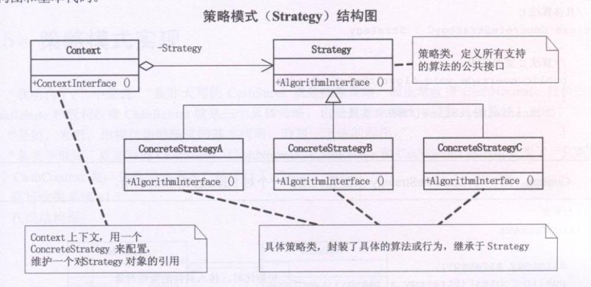

# 策略模式
```typescript
/**现金收费抽象类 */
class CashSuper {
  acceptCash(money:number) {}
}
/**正常收费子类 */
class CashNormal extends CashSuper {
  acceptCash(money:number) {
    return money
  }
}
/**打折收费子类 */
class CashRebate extends CashSuper {
  /**用于初始化折扣率 */
  constructor(public moneyRebate:number) { 
    super()
  }
  acceptCash(money) {
    return money * this.moneyRebate
  }
}
/**返利收费子类 */
class CashReturn extends CashSuper {
  constructor(public moneyCondition:number,public moneyReturn:number) {
    super()
  }
  acceptCash(money:number) {
    let result = money
    if(money >= this.moneyCondition) {
      /**实收/返利标准 等于 返利个数，实收 - 返利个数*单位返利金额 = 实际返利金额 */
      result = money - Math.floor(money/this.moneyCondition)*this.moneyReturn
    }
    return result
  }
}

/**现金收费工厂类 */
class CashFactory {
  static createCashAccept(type:string) {
    switch(type) {
      case '正常收费':
        return new CashNormal()
      case '满300返100':
        return new CashReturn(300,100)
      case '打8折':
        return new CashRebate(0.8)
    }
  }
}

const csuper = CashFactory.createCashAccept('打8折')
csuper.acceptCash(100)
```

简单工厂虽然能解决一定的问题，但是简单工厂知识解决对象的创建问题，由于工厂本身包括了所有的收费方式，而打折合额度合返利额度可能是经常变化的，所以会导致每次维护或拓展收费方式都要改动这个工厂，以致代码需重新编译部署。

## 策略模式
**面对算法的时常变动的需求**，应该要有比工厂模式更好的方法，这就是策略模式

**策略模式定义了算法家族**，分别封装起来，让它们之间可以互相替换，此模式让算法的变化，不会影响到使用算法的客户，即算法与客户实体分离。



```typescript
/* 改动部分为 取消CashFactory */
class Context {
  constructor(public strategy:any) {
    /**接受一个算法实例 */    
  }
  contextInterface() {
    return this.strategy.acceptCash()
  }
}

const context = new Context(new CashReturn(300,100))
context.contextInterface()
```

