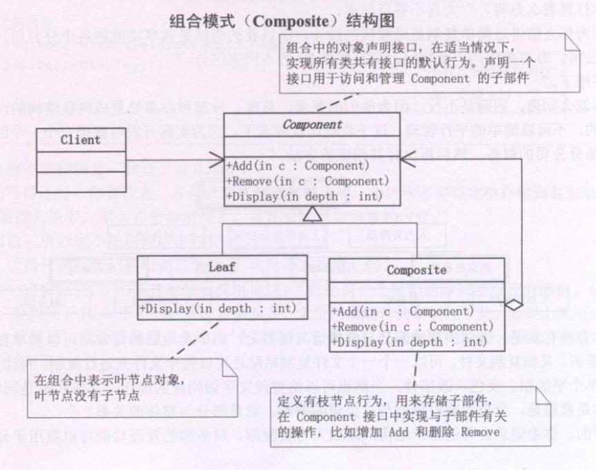

**组合模式(Composite)**，将对象组合成**树形结构**以表示‘部分-整理’的证词结构。组合模式使得用户对单个对象和组合对象的使用具有一致性。



```typescript
abstract class Component {
  public name:string

  abstract Add (c:Component):void
  abstract Remove (c:Component):void
  abstract Display(depth:number):void
}

/**叶结点 */
class Leaf extends Component {
  constructor(public name:string) {
    super()
  }
  public Add(c:Component):void {
    console.log('cannot add to a leaf')
  }
  public Remove(c:Component):void {
    console.log('cannot remove from a leaf')
  }
  public Display(depth:number):void {
    console.log(`第${depth}级，${this.name}`)
  }
}

/*有枝结点 */
class Composite extends Component {
  private children:Component[] = []
  constructor(public name:string) {
    super()
  }
  public Add(c:Component):void {
    this.children.push(c)
  }
  public Remove(c:Component):void {
    this.children.find((child,i) => {
      if(child === c) {
        this.children.splice(i)
        return true
      }
    })
  }
  public Display(depth:number):void {
    console.log(`第${depth}级，${this.name}`)
    this.children.forEach(child => console.log(`${this.name}的子级，${child.name}`))
  }
}

/**客户端代码 */
const root = new Composite('root') /**跟结点 */
root.Add(new Leaf('Leaf A'))
root.Add(new Leaf('Leaf B'))

const comp = new Composite('Composite X') 
comp.Add(new Leaf('Leaf XA'))
comp.Add(new Leaf('Leaf XB'))
root.Add(comp) /**root 的孩子结点 */

const comp2 = new Composite('Composite XY')
comp.Add(new Leaf('Leaf XYA'))
comp.Add(new Leaf('Leaf XYB'))
root.Add(comp2) /**root的孩子结点 */

root.Add(new Leaf('Leaf C'))

const leaf = new Leaf('Leaf D')
root.Add(leaf) /**root的孩子结点，该孩子结点是一个叶结点 */
root.Remove(leaf)

root.Display(1) /**展示树结构 */
```

### 透明方式与安全方式
**透明方式**，也就是说在Component中声明所有用来管理子对象的方法，其中包括Add、Remove 等。 这样实现 Component 接口的所有子类都具备了 Add和Remove。这样左的好处是叶结点和枝结点对于外界没有区别，它们具有完全一致的行为接口。但问题也很显然，因为Leaf 类本身不具备Add()、Remove()方法的功能，所以实现它是没有意义的。

**安全方式**，也就是在Component接口中不去声明Add 和 Remove方法，那么子类的Leaf 也就不需要去实现它，而是在Composite声明所有用来管理子类对象的方法，但由于不够透明，所以树叶和树枝类将不具有现同的接口，客户端的调用需要做相应的判断，带来了不便。

### 何时使用组合模式
**需求中是体现部分与整体层次的结构时**，以及你**希望用户可以忽略组合对象与单个对象的不同**，统一地使用组合结构中的所有对象时，就应考虑用组合模式

### 组合模式好处
组合模式定义了包含基本对象(如某某部门)和组合对象(如某某分公司)的类层次结构。基本对象可以被组合成更复杂的组合对象，而这个组合对象又可以被组合，这样不断地递归下去，客户代码中，任何用到基本对象的地方都可以使用组合对象了。

用户是不用关心到底是处理一个叶结点还是一个组合组件，因为一般情况下一个用户只需关注自己所处结点即可(即一个员工只需关注所属部门的事情)，也就用不着为定义组合而写一些判断语句了。

组合模式让客户可以一致地使用组合结构和单个对象，因为它们的方法实现一样。
