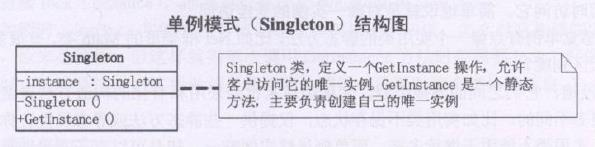

**单例模式(Singleton)**，保证一个类仅有一个实例，并提供一个访问它的全局访问点。

通常我们可以让一个全局变量使得一个对象被访问，但它不能防止你实例化多个对象。一个最好的办法就是，让类自身负责保存它的**唯一实例**，这个类可以保证没有其他实例可以被创建，并且它可以提供一个访问该实例的方法。

```typescript
class Singleton {
  private static instance:Singleton
  public static getInstance() {
    if(!this.instance) {
      this.instance = new Singleton()
    } 
    return this.instance
  }
}

const s1 = Singleton.getInstance()
const s2 = Singleton.getInstance()

if(s1 === s2) {
  console.log('两个对象是相同的实例')
}
```

### 多线程时的单例
lock是确保当一个线程位于代码的临界区时，另一个线程不进入临界区。如果其他线程试图进入锁定的代码，则它将一直等待（即被阻止），直到该对象被释放。

### 静态初始化
静态初始化的方式是在自己被加载时就将自己实例化，所以被形象地称之为饿汉式单例类，原先的单例模式处理方式是要在第一次被引用时，才会将自己实例化，所以就被称为懒汉式单例类。