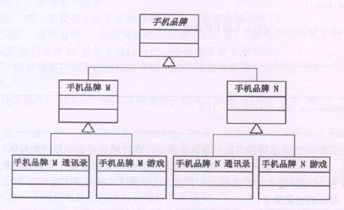
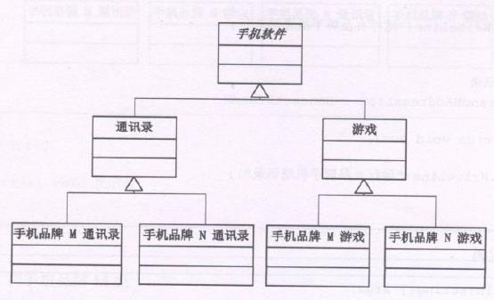
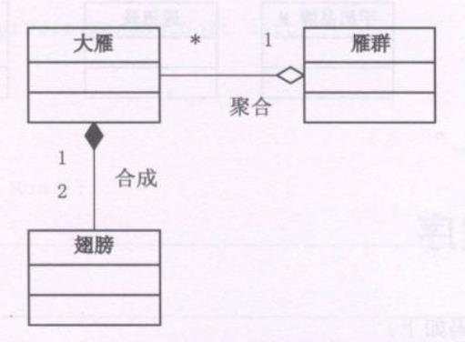

这是两个软件基于两个品牌的手机在兼容性上的两种解决方案

**方案一**

**方案二**


假如我们要新增一个拍照功能时，

在方案一中，那么我们需要对拍照功能写两次，即手机品牌M 拍照 和 手机品牌N 拍照, 它们分别继承各自的品牌。

而在方案二中。我们需要新增一个拍照抽象类，再新增手机品牌M 拍照 和 手机品牌N 拍照，分别继承拍照抽象类

二假如我们要新增品牌时，其实情况还是一样，只不过方案一和方案二的情况调转了而已。

### 继承的麻烦
事实上当前的情况其实就是在某些情况下继承锁带来的麻烦。比如，

**对象的继承关系是在编译时就定义好了，所以无法在运行时改变从父类继承的实现**。

**子类的实现与它的父类有非常紧密的依赖关系，以至于父类实现中的任何变化必然会导致子类发生变化**。

**当需要复用子类时，如果继承下来的实现不适合解决新的问题，则父类必须重写或被其他更适合的类替换。这种依赖关系限制了灵活性并最终限制了复用性**。

## 合成/聚合复用原则

合成/聚合复用原则(CARP)，**尽量使用合成/聚合，尽量不要使用类继承**

合成(Composition)和聚合(Aggregation)都是关联得特殊种类。

**聚合表示一种弱的‘拥有’关系，体现的是A对象可以包含B对象，但B对象不是A对象得一部分**。

**合成则是一种强的‘拥有’关系，体现了严格的部分和整体的关系，部分和整体的生命周期一样**。



### 合成/聚合复用原则的好处
优先使用对象的合成/聚合将有助于你保持每个类被封装，并被几种在单个任务上。这样类和类继承层次会保持较小规模，并且不太可能增长为不可控制的庞然大物。

```typescript
/**手机软件 */
abstract class HandsetSoft {
  public abstract Run()
}

/**手机游戏 */
class HandsetGame extends HandsetSoft {
  public Run() {
    console.log('运行手机游戏')
  }
}

/**手机通讯录 */
class HandsetAddressList extends HandsetSoft {
  public Run() {
    console.log('运行手机通讯录')
  }
}

abstract class HandsetBrand {
  protected soft:HandsetSoft
  
  /**品牌需要关注软件，所以可在机器中安装软件，以备运行 */
  /**这里是实现聚合的核心方法*/
  public setHandsetSoft(soft:HandsetSoft) {
    this.soft = soft
  }
  
  /**运行 */
  public abstract Run() 
} 

/**手机品牌N */
class HandsetBrandN extends HandsetBrand {
  public Run() {
    this.soft.Run()
  }
}

/**手机品牌M */
class HandsetBrandM extends HandsetBrand {
  public Run() {
    this.soft.Run()
  }
}

let ab = new HandsetBrandN
ab.setHandsetSoft(new HandsetGame())
ab.Run()

ab.setHandsetSoft(new HandsetAddressList())
ab.Run()

ab = new HandsetBrandM
ab.setHandsetSoft(new HandsetGame())
ab.Run()

ab.setHandsetSoft(new HandsetAddressList())
ab.Run()
```
假如要新增一个MP3功能那么只需要增加具体的手机软件类即可，不会影响到其他任何类。类的个数增加也只是一个。这显然也符合了开放/封闭原则。也就是优先使用对象的合成或聚合，而不是类继承的一个具体例子。**继承是一种强耦合的结构，一定要在‘is-a’的关系时次考虑使用**

### 桥接模式
在合成/聚合复用原则的手机品牌和软件的UML图中，我们会发现两个抽象类之间的聚合线像一座桥，而在该例子中所应用到的模式即‘桥接模式’。

**桥接模式(Bridge)，将抽象部分与它的实现部分分离，使它们可以独立地变化**。

什么叫抽象与它的实现分离，这并不是说，让抽象类与其派生类分离，因为这没有任何意义。实现指的是抽线类和它的派生类用来实现自己的对象
