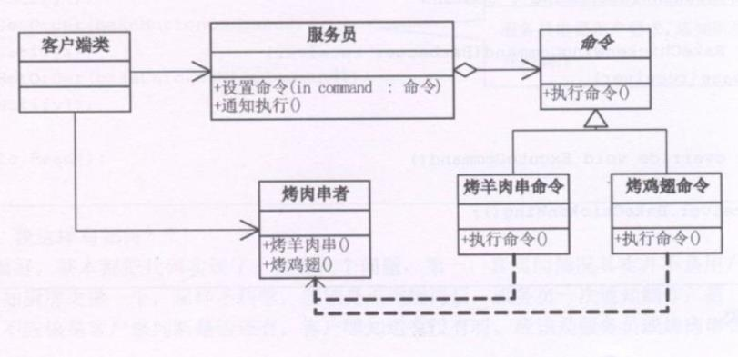
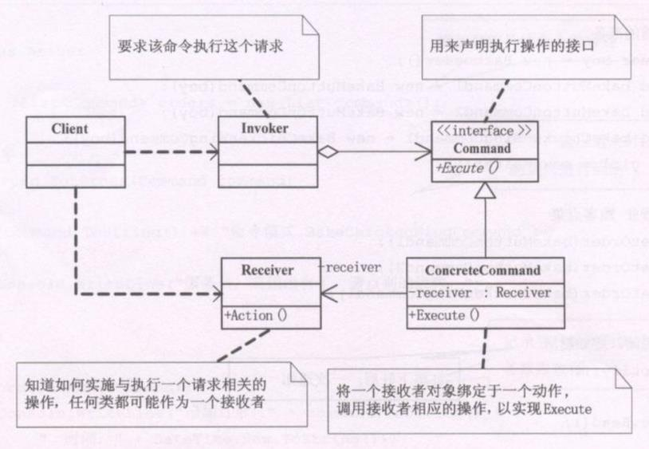

**命令模式(Command)**，将一个请求封装为一个对象，从而使你可用不同的请求对客户进行参数化，对请求排队或记录请求日志，以及支持可撤销的操作。

命令模式是为了解决客户端与业务层的紧耦合，让业务层只需专注于所收到的命令，并完成自己的业务，而无需知道客户是谁，所以业务与客户之间会存在一个中介者负责接收客户的请求并对业务层发出命令。

例如，假如是按紧耦合的设计的话，就像是街边推着车卖羊肉串的小商贩，此时顾客将直接跟小商贩下单，但当同时间下单的人很多时，小商贩由于忙着自己烤羊肉的工作就会漏下单，下错单，结错账，给错人等等问题。而按松耦合进行设计的话，就像羊肉串店，店里还有一个服务生，老板只需要关注服务生的记录上下了什么单即可，而无需知道是哪个客人点的，也无需关注收钱，取消的问题。

### 命令模式作用
1. 它能较容易地设计一个命令队列
2. 在徐娅的情况下，可以较容易地将命令级入日志
3. 允许接受请求的一方决定是否要否决请求
4. 可以容易地实现对请求的撤销和重做
5. 由于加进新的具体命令类不影响其他的类，因此增加新的具体命令类很容易

**核心优点**，命令模式把请求一个操作的对象与指导怎么执行一个操作的对象分隔开。

### 敏捷开发
敏捷开发原则告诉我们，不要为代码添加基于猜测的、实际不需要的功能。如果不清楚一个系统是否需要命令模式，一般就不要着急去实现它，事实上，在需要的时候通过重构实现这个模式并不困难，只有在真正需要如撤销/回复等功能时，把原来的代码重构为命令模式才有意义。