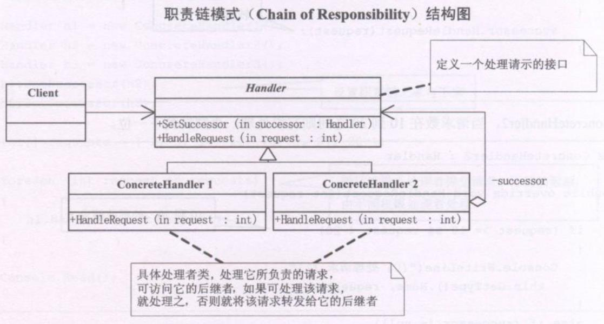

**职责链模式(Chain of Responsibility)**，使多个对象都有机会处理请求，从而避免请求的发送者和接收者之前的耦合关系。将这个对象连成一条链，并沿着这条链传递改请求，直到有一个对象处理它为止


```typescript
abstract class Handler {
  protected successor:Handler
  public SetSuccessor(successor:Handler) {
    this.successor = successor
  }
  public abstract HandleRequet(request):void
}

class ConcreteHandler1 extends Handler {
  public HandleRequet(request:Number) {
    if(request >= 0 && request < 10) {
      console.log('处理请求')
    }else if(this.successor !== null){
      this.successor.HandleRequet(request)
    }
  }
}

class ConcreteHandler2 extends Handler {
  public HandleRequet(request) {
    if(request >= 10 && request < 20) {
      console.log('处理请求')
    }else if(this.successor) {
      this.successor.HandleRequet(request)
    }
  }
}

class ConcreteHandler3 extends Handler {
  public HandleRequet(request) {
    if(request >= 20 && request < 30) {
      console.log('处理请求')
    }else if(this.successor) {
      this.successor.HandleRequet(request)
    }
  }
}

/**客户端 */
const h1 = new ConcreteHandler1()
const h2 = new ConcreteHandler2()
const h3 = new ConcreteHandler3()
h1.SetSuccessor(h2)
h2.SetSuccessor(h3)

const request = [2,5,14,22,18,3,27,20]

request.forEach(req => h1.HandleRequet(req))
```

### 职责链的好处
当客户提交一个请求时，请求是沿链传递直至有一个ConcreteHandler对象负责处理它。

接收者和发送者都没有对方的明确信息，且链中的对象自己也并不直到链的结构。结果是职责链可以简化对象的互相连接，它们仅需保持一个只想其后继者的引用，而不需保持它所有的候选接收者的引用。

随时地增加或修改处理一个请求的结构。增强了对象指派职责的灵活性。

缺点：一个请求极有可能到了链的末端都得不到处理，或者因为没有正确配置而得不到处理。