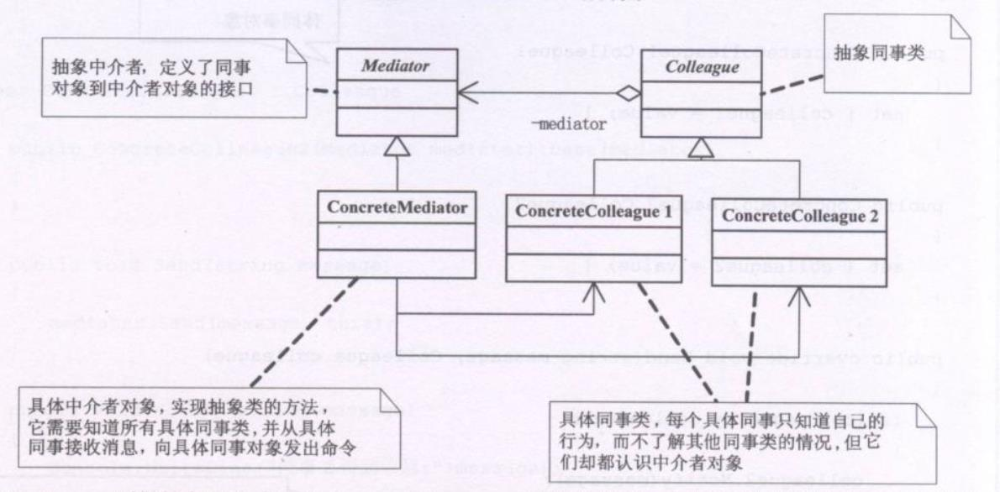

**中介者模式(Mediator)**，用一个中介对象来封装一系列的对象交互，中介者使得各对象不需要显式地相互引用，从而使其耦合松散，而且可以独立地改变它们之间的交互。

```typescript
/**抽象中介者 */
abstract class Mediator {
  /**定义一个抽线搞得发送消息方法 */
  public abstract Send(message:string,colleague:Colleague)
}
/**抽象同事类 */
abstract class Colleague {
  protected mediator:Mediator
}

/**具体中介者 */
class ConcreteMediator extends Mediator {
  colleague1:ConcreteColleague1
  colleague2:ConcreteColleague2
  
  public Send(message:string,colleague:Colleague) {
    if(colleague === this.colleague1) {
      this.colleague2.Notify(message)
    } else {
      this.colleague1.Notify(message)
    }
  }
}

/**具体同事类 */
class ConcreteColleague1 extends Colleague {
  constructor(protected mediator:Mediator) {
    super()
  }
  public Send(message) {
    this.mediator.Send(message,this)
  }
  public Notify(message) {
    console.log('同事1得到得到消息:' + message)
  }
}

class ConcreteColleague2 extends Colleague {
  constructor(protected mediator:Mediator) {
    super()
  }
  public Send(message) {
    this.mediator.Send(message,this)
  }
  public Notify(message) {
    console.log('同事2得到得到消息:' + message)
  }
}

/**客户端 */
const m = new ConcreteMediator()

// 让两个同事认识中介者
const c1 = new ConcreteColleague1(m) 
const c2 = new ConcreteColleague2(m)
// 让中介者认识两个同事对象
m.colleague1 = c1
m.colleague2 = c2

c1.Send('吃过饭了吗') /**通过m后，c2 得到该消息 */
c2.Send('没有呢，你请客？') /* 通过m后， c1得到该消息 */
```

### 中介者优缺点
中介者模式很容易在系统中应用，也很容易在系统中误用。当系统出现了‘多对多’交互复杂的对象群时，不要基于使用中介者模式，而要先反思你的系统在设计上是不是合理。

Mediator的出现减少了各个Colleague的耦合，使得可以独立地改变和复用各个Colleague类和Mediator。其次由于把对象如何协作进行路抽象，将中介作为一个独立的概念并将其封装在一个对象中，这样关注的对象就从对象各自本身的行为转移到它们之间的交互上来，也就是栈在一个更宏观的角度去看待系统

由于ConcreteMediator控制了集中化，于是就把交互复杂性变为了中介者的复杂性，这就使得中介者会变得比任何一个ConcreteColleague都复杂。

中介者模式一般应用于一组对象以定义良好但是复杂的方式进行通信的场合，以及想定制一个分布在多个类中的行为，而又不想生成太多的子类的场合。

例子： 公司间各部门的协作，联合国与各国家的关系。