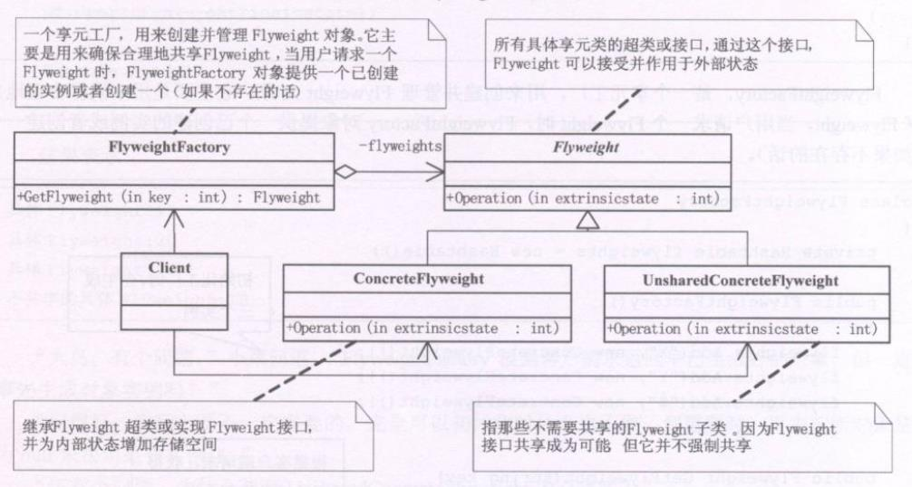
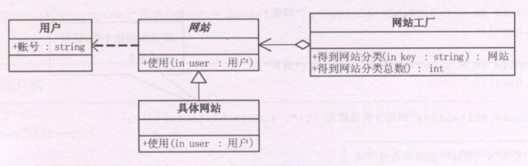

**享元模式(Flyweight)**，运动共享技术有效地支持大量细粒度的对象

```typescript
abstract class Flyweight {
  public abstract Operation(state):void
}

class ConcreteFlyweight extends Flyweight {
  public Operation(state) {
    console.log(`具体Flyweight:${state}`)
  }
}

class UnsharedConcreteFlyweight extends Flyweight {
  public Operation(state) {
    console.log(`不共享的具体Flyweight:${state}`)
  }
}

/**享元工厂，用于创建并管理Flyweight对象 */
class FlyweightFactory {
  private flyweights = {
    x: null,
    y: null,
    z: null
  }
  constructor() {
    this.flyweights.x = new ConcreteFlyweight()
    this.flyweights.y = new ConcreteFlyweight()
    this.flyweights.z = new ConcreteFlyweight()
  }

  public GetFlyweight(key:string):Flyweight {
    return this.flyweights[key]
  }
}

let state = 22
const f = new FlyweightFactory()
const fx = f.GetFlyweight('x')
fx.Operation(--state)
const fy = f.GetFlyweight('y')
fy.Operation(--state)
const fz = f.GetFlyweight('z')
fz.Operation(--state)

const uf = new UnsharedConcreteFlyweight()
uf.Operation(--state)
```


### 内部状态与外部状态
享元模式可以避免大量非常相似类的开销。在程序设计中，有时需要生成大量细粒度的类实例来表示数据。如果能发现这些实例除了几个参数外基本上都是相同的，有时就能够受大幅度减少需要实例化的类的数量。如果能把那些参数移到类实例外面，在方法调用时将它们传递进来，进剋通过共享大幅度地减少单个实例的数目。

### 享元模式应用
如果一个应用程序使用了大量的对象，而大量的这些对象造成了很大的存储开销时就应该考虑使用；还有就是对象的大多数状态可以外部状态，如果删除对象的外部状态，那么可以用相对较少的共享对象取代很多组对象时，就可以考虑使用享元模式。
