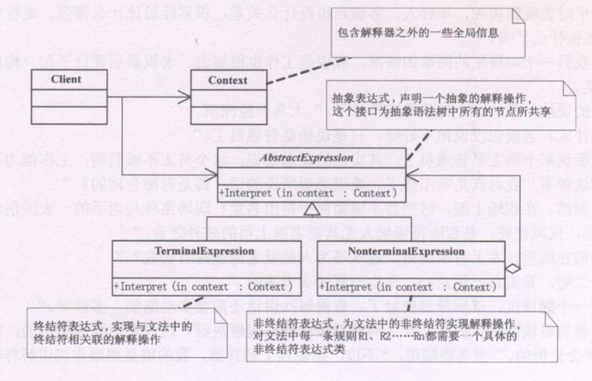
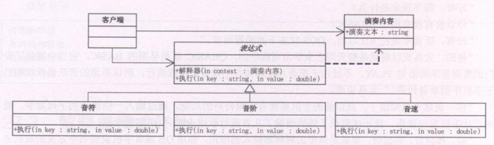

**解释器模式(interpreter)**，给定一个语言，定义它的文法的一种表示，并定义一个解释器，这个解释器使用该表示来解释语言中的语句。

**解释器模式需要解决的是**，如果一个**特定类型的问题发生的频率足够高**，那么可能就值得将该问题的各个实例**表述为一个简单语言中的句子**。这样就可以构建一个解释器，该解释器通过解释这些句子来解决该问题。


```typescript
/**包含了解释器之外的一些全局信息 */
class Context {
  private _input:string
  private _output:string
  get Input() {
    return this._input
  }
  set Input(value) {
    this._input = value
  }
  get Output() {
    return this._output
  }
  set Output(value) {
    this._output = value
  }
}

/**抽象表达式 */
abstract class AbstractExpression {
  public abstract Interpret(context:Context):void
}

/**终结符表达式 */
class TerminalExpression extends AbstractExpression {
  Interpret(context:Context) {
    console.log('终端解释器，对上下文进行解释')
  }
}

/**非终结符表达式 */
class NonterminalExpression extends AbstractExpression {
  Interpret(context:Context) {
    console.log('非终端解释器，对上下文进行解释')
  }
}

/**客户端 */
const context = new Context
const list:AbstractExpression[] = []
list.push(new TerminalExpression())
list.push(new NonterminalExpression())

list.forEach(exp => {
  /**对上下文中相关的表达式进行解释 */
  exp.Interpret(context)
})
```

### 解释器模式好处
当有一个语言需要解释执行，并且你可将该语言中的句子表示为一个抽象语法树时，可使用解释器模式。

容易地改变和拓展文法，一位内该模式使用类来表示文法规则，你可使用继承来改变或拓展该文法。也比较容易实现文法，因为定义抽象语法树中各个结点的类的实现答题类似，这些类都易于直接编写。

**不足**，解释器模式为文法中的每一条规则至少定义了一个类，因此包含许多规则的文法可能难以管理和维护。建议当文法非常复杂时，使用其他的技术如语法分析程序或编译器生成器来处理。

### 音乐播放器实现
