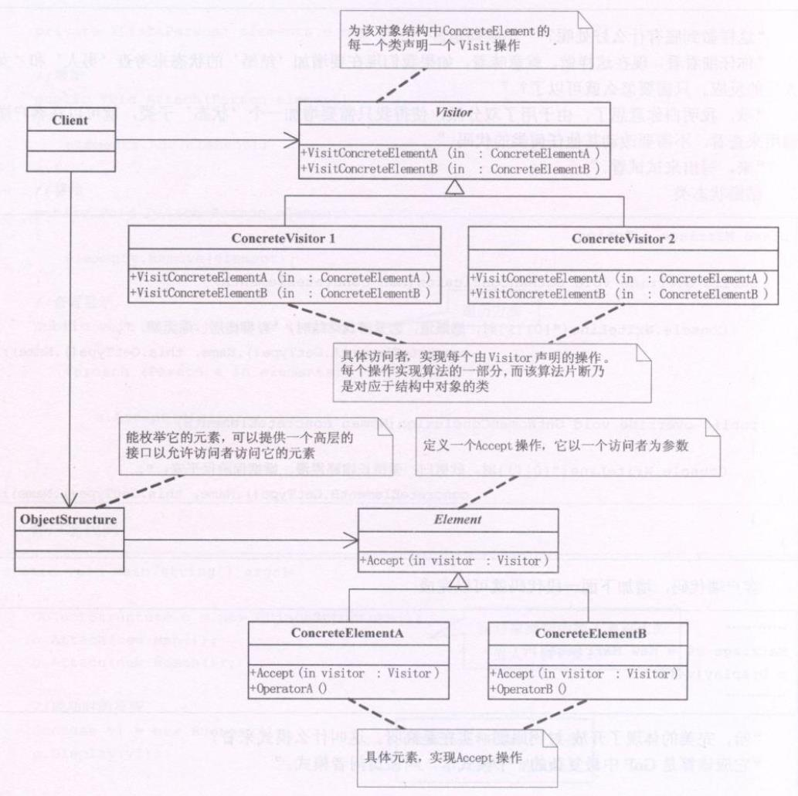

**访问者模式(Visitor)**，表示一个作用于某对象结构中的各元素的操作。它使你可以在不改变各元素的类的前提下定义作用于这些元素的新操作。


### 例子
```
男人成功时，背后多半有一个伟大的女人
女人成功时，背后大多有一个不成功的男人。

男人失败时，闷头喝酒，谁也不用劝
女人失败时，眼泪旺旺，谁也劝不动

男人恋爱时，凡事不懂也要装懂
女人恋爱时，遇事懂也装作不懂
```
在这里，Element就是我们的‘人’类，而ConcreteElementA和ConcreteElementB就是‘男人’和‘女人’，Vistor就是我们写的‘状态’类，具体的ConcreteVistor就是那些‘成功’、‘失败’、‘恋爱’等状态。至于ObjectStructure就是‘对象结构’类了。

男女对比这么多的原因是因为人类在性别上就只有男人和女人两类。而这也正是访问者模式可以实施的前提

**访问者模式适用于数据结构相对稳定的系统，它把数据结构和作用域结构上的操作之间的耦合解脱开，使得操作集合可以相对自由地演化**

**访问者模式的目的是要把处理从数据结构分离出来**。**有比较稳定的数据结构，又有易于变化的算法的话，使用访问者模式就是比较何时的，因为访问者模式使得算法操作的增加变得容易**。

**访问者模式的优点**，增加新的操作很容易，因为增加新的操作就意味着增加一个新的访问者。访问者模式将有关的行为集中到一个访问者对象中。

**缺点**，其实也就是使增加新的数据结构变得困难。

```typescript
/**Vistor类，对应‘男人’‘女人’的状态 */
abstract class Visitor {
  public abstract VisitConcreteElementA(concreteElementA:ConcreteElementA):void
  public abstract VisitConcreteElementB(concreteElementB:ConcreteElementB):void
}
/**具体访问者1，对应‘恋爱’状态时 */
class ConcreteVisitor1 extends Visitor {
  VisitConcreteElementA(concreteElementA:ConcreteElementA) {
    console.log(concreteElementA, 'A相关的行为')
  }
  VisitConcreteElementB(concreteElementB:ConcreteElementB) {
    console.log(concreteElementB, 'B相关的行为')
  }
}
/**‘失败’状态时 */
class ConcreteVisitor2 extends Visitor {
  VisitConcreteElementA(concreteElementA:ConcreteElementA) {
    console.log(concreteElementA, 'A相关的行为')
  }
  VisitConcreteElementB(concreteElementB:ConcreteElementB) {
    console.log(concreteElementB, 'B相关的行为')
  }
}

/**元素类，对应人类 */
abstract class Element1 {
  abstract Accept(visitor:Visitor):void
}

/**对应男人 */
class ConcreteElementA extends Element1 {
  Accept(visitor:Visitor) {
    visitor.VisitConcreteElementA(this)
  }
  OperationA() {
    /**其他相关的方法 */
  }
}

class ConcreteElementB extends Element1 {
  Accept(visitor:Visitor) {
    visitor.VisitConcreteElementB(this)
  }
  OperationA() {
    /**其他相关的方法 */
  }
}
/**数据结构类 */
class ObjectStructure {
  private elements:Element1[] = []
  public Attach(element:Element1) {
    this.elements.push(element)
  }
  public Accept(visitor:Visitor) {
    this.elements.forEach(e => {
      e.Accept(visitor)
    })
  }
}

/**客户端 */
const o = new ObjectStructure()
o.Attach(new ConcreteElementA())
o.Attach(new ConcreteElementB())

const v1 = new ConcreteVisitor1()
const v2 = new ConcreteVisitor2()

o.Accept(v1) /**恋爱时，男人和女人的行为 */
o.Accept(v2) /**失败时，男人和女人的行为 */
```