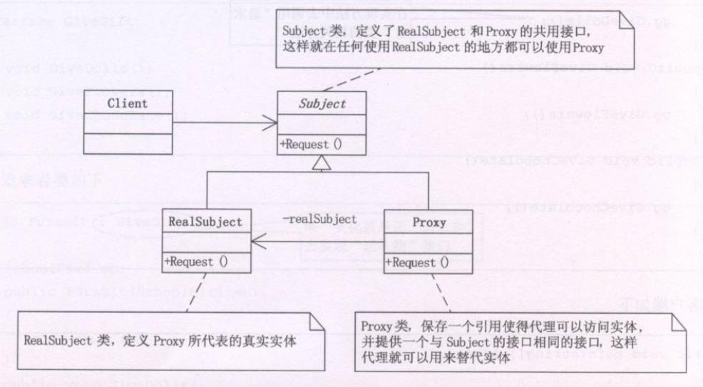

**代理模式(Proxy)**，为其他对象提供一种代理以控制对这个对象的访问。


```typescript
class Subject {
  public request() {}
}

/**请求者 */
class RealSubject extends Subject {
  public request() {
    console.log('真实的请求')
  }
}

/**中介者 */
class Proxy1 extends Subject {
  protected realSubject:Subject
  public request() {
    if(this.realSubject === null) {
      this.realSubject = new RealSubject()
    }
    /**在发送请求前可以卡各类条件去控制对目标的访问 */
    this.realSubject.request()
  }
}


const proxy1 = new Proxy1()
proxy1.request()
```


### 代理模式的应用
**远程代理，也就是为一个对象在不同的地址空间提供局部代表。这样可以隐藏一个对象存在于不同地址空间的事实**。DNS服务器代理

**虚拟代理，是根据需要创建开销很大的对象。通过它来存放实例化需要很长时间的真实对象**。例如需要打开一个很大的HTML网页，里面包含了很多的图片和文字。但你还是可以很快打开它，此时你所看到的是所有的文字，但图片却是一张一张地下载候才能看到，那些为打开的图片框，就是通过虚拟代理来替代了真实的图片，此时存储了真实图片的路径和尺寸。

**安全代理，用来空指真实对象访问时的权限**，一般用于对象应该有不同的访问权限的时候。

**智能代理，是指当调用真实对象时，来历处理另外一些事**。如计算真实对象的引用次数，当没有引用时释放它，或第一次引用持久对象时，将它装入内存，或在访问一个实际对象前，检查是否已经锁定它，以确保其他对象不能改变它。